# Spring Boot Minio


### 📖 Information

<ul style="list-style-type:disc">
  <li>MinIO is the only object storage suite available on
      every public cloud with supporting high-performance.</li>
  <li>It is API compatible with Amazon S3 cloud storage service</li>    
  <li>It can handle unstructured data such as photos, videos, log files, backups, and container images with (currently) the maximum supported object size of 5TB.</li>
  <li>Here is the explanation of the project
      <ul>
        <li>Implement the process of uploading file to Minio</li>
        <li>Implement the process of downloading file from Minio</li>
        <li>Implement the process of adding bucketname to Minio</li>
        <li>Implement the process of listing all file from bucketname in Minio</li>
        <li>Implement the process of listing all bucketnames in Minio</li>
        <li>Implement the process of deleting bucketname from Minio</li>
        <li>Implement the process of deleting file list from bucketname from Minio</li>
        <li>Implement the process of deleting file from bucketname from Minio</li>
      </ul>
  </li>
</ul>

### 🔨 Run the App

<b>1 )</b> Install <b>Docker Desktop</b>. Here is the installation <b>link</b> : https://docs.docker.com/docker-for-windows/install/

<b>2 )</b> Open <b>Terminal</b> under <b>resources</b> folder to run <b>Minio</b> on <b>Docker</b> Container
```
    docker-compose up -d
```
<b>3 )</b> Open <b>Minio</b> in the Browser 
```
    127.0.0.1:9001
```
<b>4 )</b> Enter username and password 
```
    username : minioadmin
    password : minioadmin
```
<b>5 )</b> Explore Rest APIs
<table style="width:100%">
  <tr>
    <th>Method</th>
    <th>Url</th>
    <th>Description</th>
    <th>Valid Request Body</th>
    <th>Valid Request Params</th>
  </tr>
  <tr>
    <td>POST</td>
    <td>/upload</td>
    <td>Upload file to Minio</td>
    <td>[Info](#upload)</td>
    <td></td>
  </tr>
  <tr>
      <td>POST</td>
      <td>/addBucket/{bucketName}</td>
      <td>Add BucketName in Minio</td>
      <td></td>
      <td>[Info](#addBucketName)</td>
  </tr>
  <tr>
      <td>GET</td>
      <td>/show/{bucketName}</td>
      <td>Show defined Bucketname by its name in Minio</td>
      <td></td>
      <td>[Info](#showBucketName)</td>
  </tr>
  <tr>
      <td>GET</td>
      <td>/showBucketName</td>
      <td>Show all BucketNames in Minio</td>
      <td></td>
      <td>[Info](#showAllBucketName)</td>
  </tr>
  <tr>
      <td>DELETE</td>
      <td>/removeBucket/{bucketName}</td>
      <td>Delete defined bucketname from Minio</td>
      <td></td>
      <td>[Info](#deleteBucketName)</td>
  </tr>
  <tr>
       <td>DELETE</td>
       <td>/removeObject/{bucketName}/{objectName}</td>
       <td>Delete defined object in defined bucketname from Minio</td>
       <td></td>
       <td>[Info](#deleteBucketName)</td>
  </tr>
  <tr>
       <td>DELETE</td>
       <td>/removeListObject/{bucketName}</td>
       <td>Remove object list in defined bucketname from Minio</td>
       <td>[Info](#deleteListObject)</td>
       <td></td>
  </tr>
  <tr>
       <td>GET</td>
       <td>/showListObjectNameAndDownloadUrl/{bucketName}</td>
       <td>List object names and its download url in defined bucketname of Minio</td>
       <td></td>
       <td>[Info](#objectInformation)</td>
  </tr>
  <tr>
       <td>GET</td>
       <td>/download/{bucketName}/{objectName}</td>
       <td>Download object in BucketName from Minio</td>
       <td></td>
       <td>[Info](#download)</td>
  </tr>
</table>

### Used Dependencies
* Spring Boot Web
* Minio
* Lombok
* AspectJ
* Apache Commons Lang
* Swagger

## Swagger
> **Access : http://localhost:8085/swagger-ui.html**

## Valid Request Body

##### <a id="upload">Upload -> http://localhost:8085/minio/upload</a>
```
    file : Uploaded File
    bucketname : commons
```

##### <a id="deleteListObject">Delete List Object-> http://localhost:8085/minio/removeListObject/{bucketName}</a>
```
   [
       "de43ab54e89f4879a2baf87df1570f56.PNG",
       "f107737d21534f42a72dcf009a64a07d.PNG"
   ]
```

## Valid Request Params

##### <a id="addBucketName">Add Bucket Name -> http://localhost:8085/minio/addBucket/{bucketName}</a>
```
   http://localhost:8085/minio/addBucket/test1
```

##### <a id="showBucketName">Show Bucket Name -> http://localhost:8085/minio/show/{bucketName}</a>
```
   http://localhost:8085/minio/show/commons
```

##### <a id="showAllBucketName">Show All Bucket Names -> http://localhost:8085/minio/showBucketName</a>
```
   http://localhost:8085/minio/showBucketName
```

##### <a id="deleteBucketName">Delete Bucket Name -> http://localhost:8085/minio/removeBucket/{bucketName}</a>
```
   http://localhost:8085/minio/removeBucket/test1
```

##### <a id="objectInformation">List Object Information -> http://localhost:8085/minio/showListObjectNameAndDownloadUrl/{bucketName}</a>
```
   http://localhost:8085/minio/removeBucket/test1
```

##### <a id="download">Download File -> http://localhost:8085/minio/removeBucket/{bucketName}</a>
```
   http://localhost:8085/minio/download/commons/ad94ff2e9b404772a1f9b98f4e11b4f9.PNG
```

### Screenshots

<details>
<summary>Click here to show the screenshots of project</summary>
    <p> Figure 1 </p>
    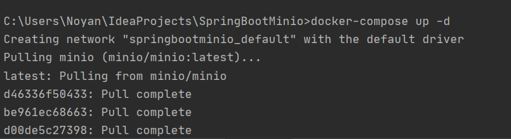
    <p> Figure 2 </p>
    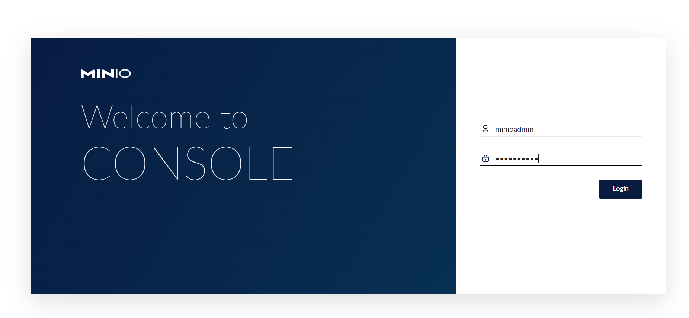
    <p> Figure 3 </p>
    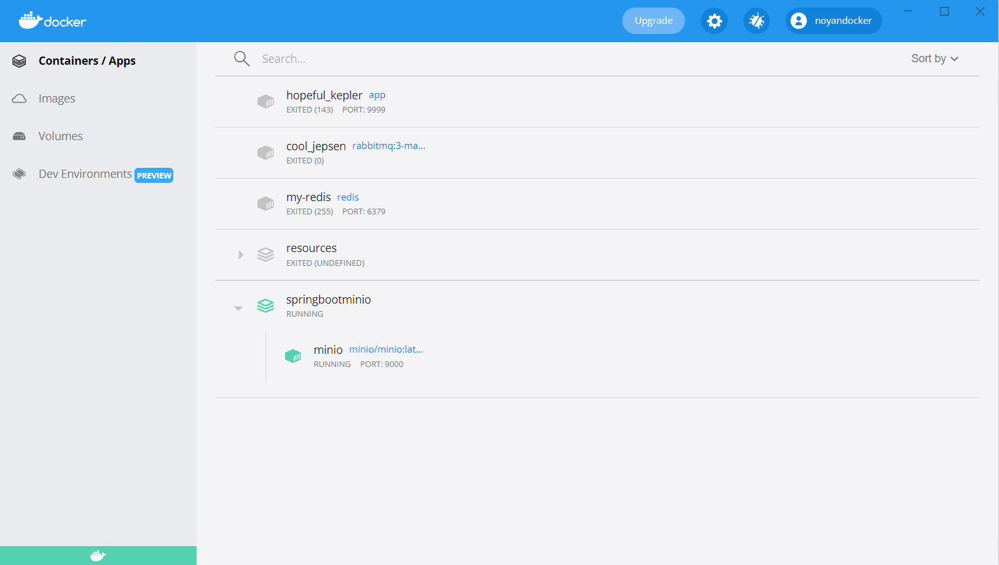
    <p> Figure 4 </p>
    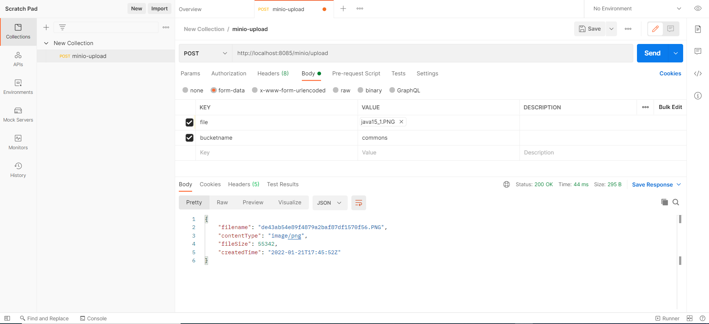
    <p> Figure 5 </p>
    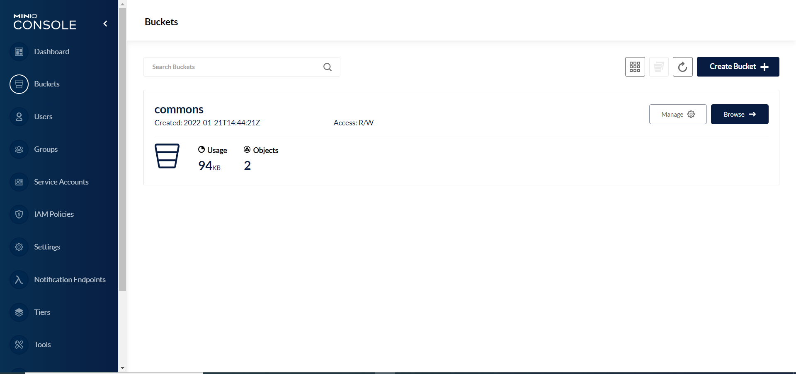
    <p> Figure 6 </p>
    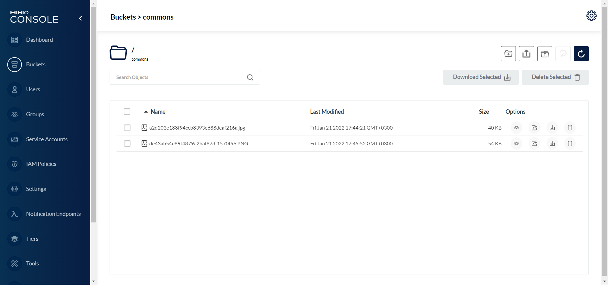
    <p> Figure 7 </p>
    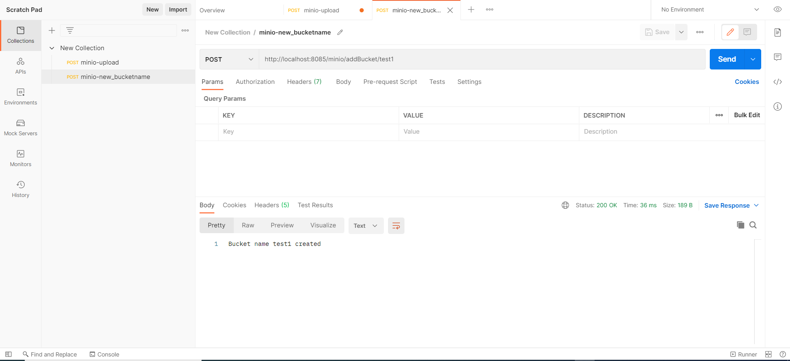
    <p> Figure 8 </p>
    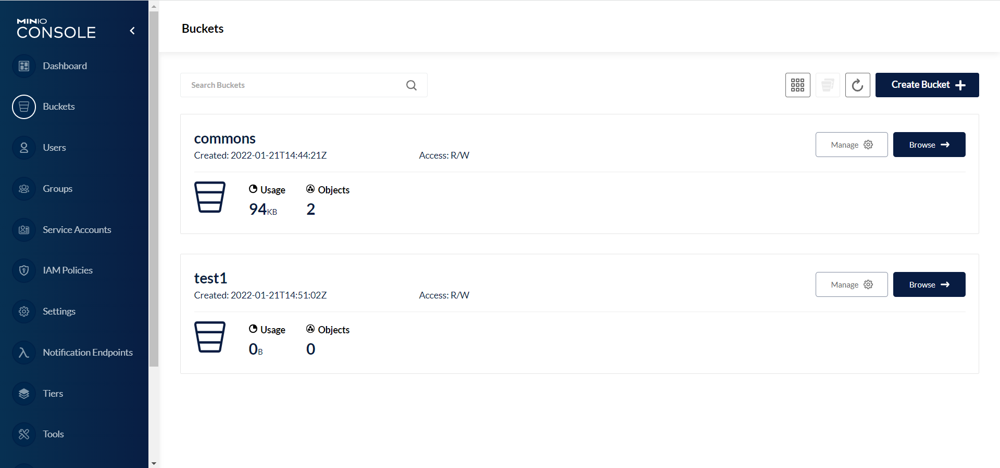
    <p> Figure 9 </p>
    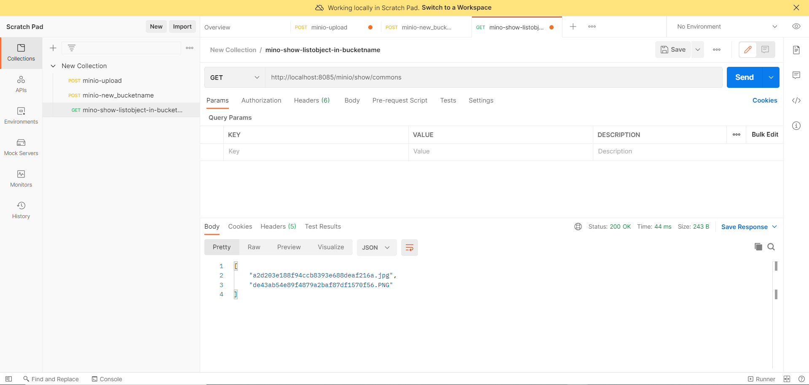
    <p> Figure 10 </p>
    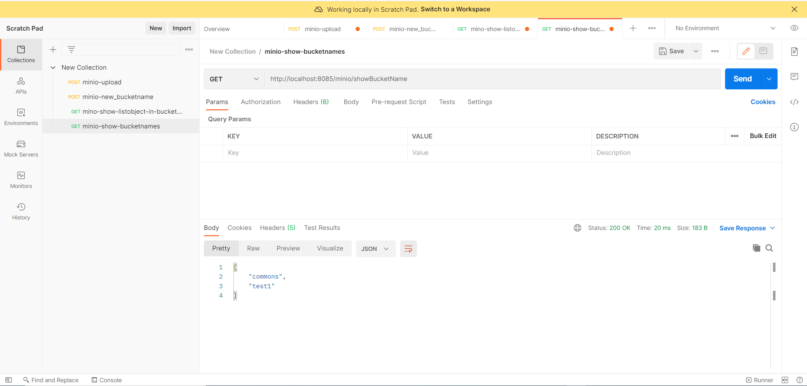
    <p> Figure 11 </p>
    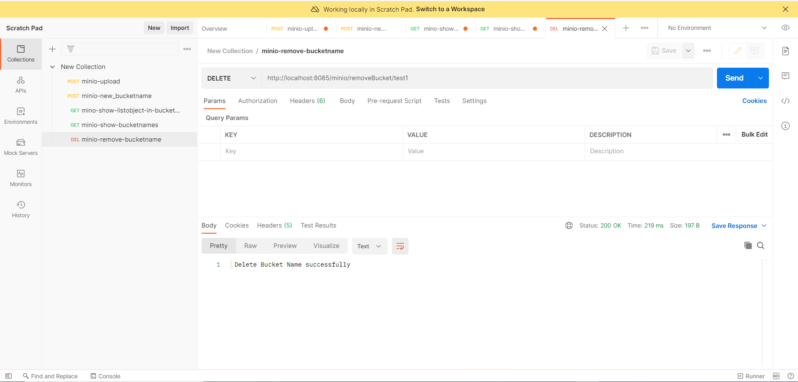
    <p> Figure 12 </p>
    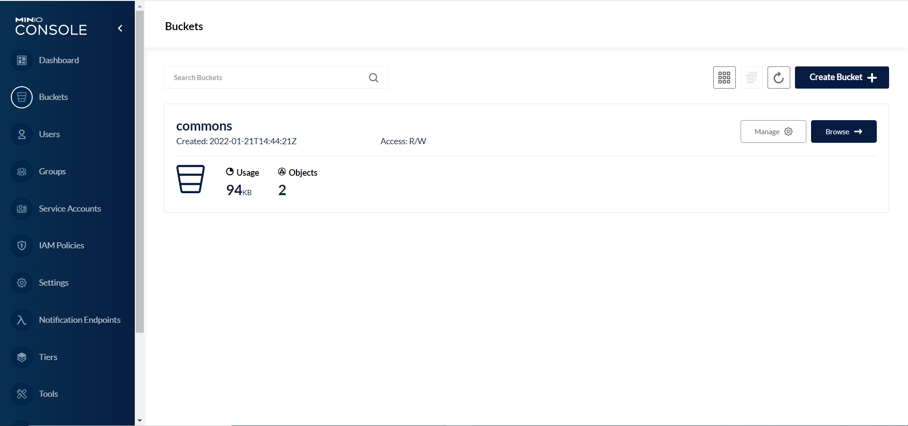
    <p> Figure 13 </p>
    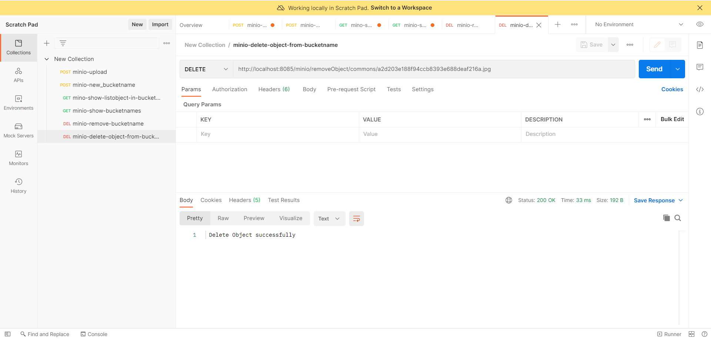
    <p> Figure 14 </p>
    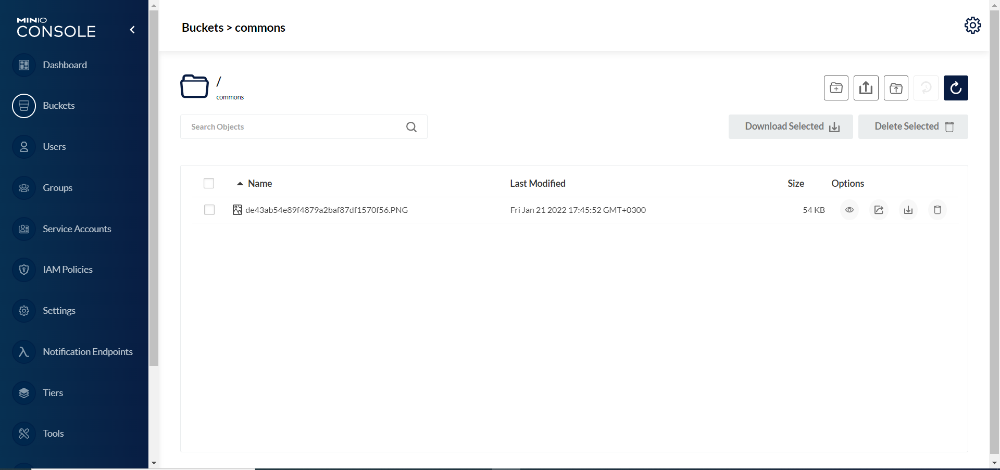
    <p> Figure 15 </p>
    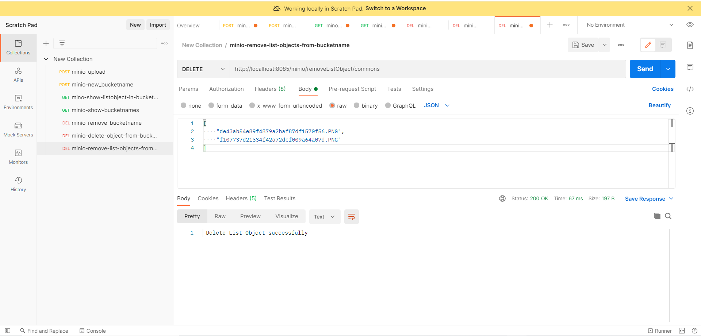
    <p> Figure 16 </p>
    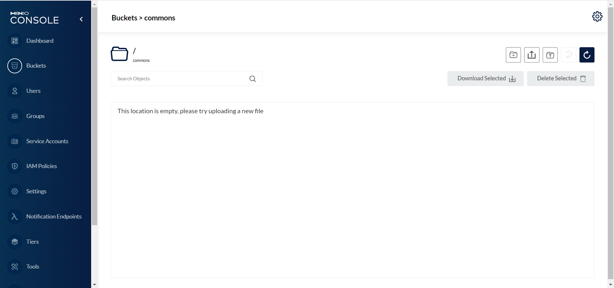
    <p> Figure 17 </p>
    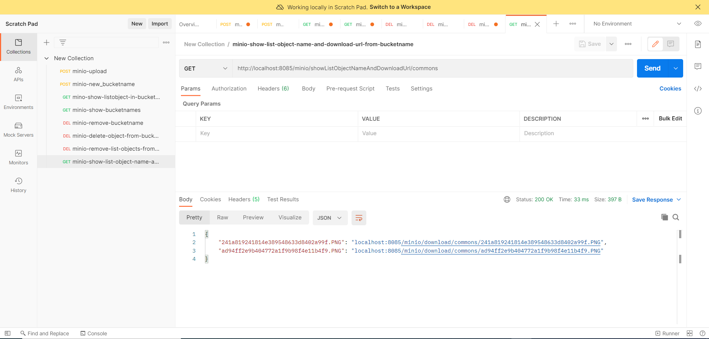
    <p> Figure 18 </p>
    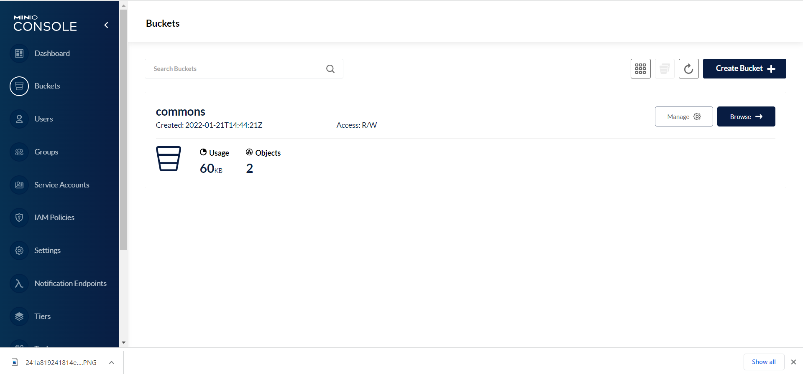
    <p> Figure 19 </p>
    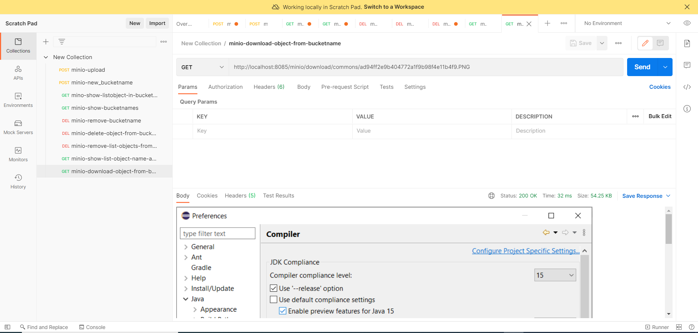
    <p> Figure 20 </p>
    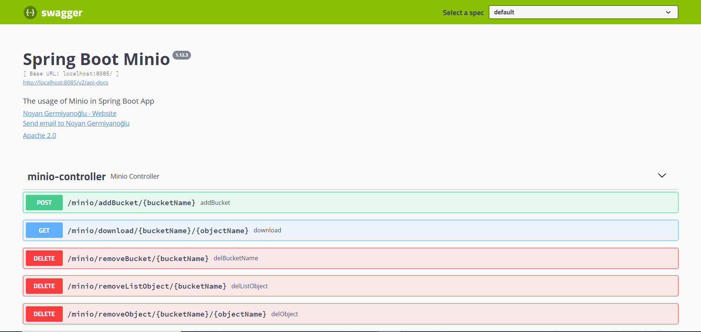
</details>